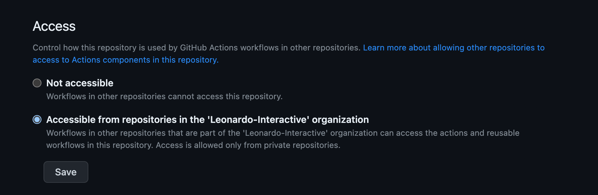

# gh-action-handle-web-slack-documentation

Automatically posts a Slack message into the [#web-releases](https://leonardoai.slack.com/archives/C058JSC5BNF) channel to notify the company of a new release.

## Getting Started

### Prerequisites

Before you begin, ensure you have met the following requirements:

- The Slack Application known as 'Spider Bot' is active and running in the Leonardo.Ai Slack
- The Slack Application known as 'Spider Bot' has access to send messages in the [#web-releases](https://leonardoai.slack.com/archives/C058JSC5BNF) channel

### Installation

1. Make sure 'Access' under this repositories Action settings is set to 'Accessible from repositories in Leonardo-Interactive organization'.
   

2. Ensure the following secrets are on the [Leonardo Platform](https://github.com/Leonardo-Interactive/leonardo-platform) repository

- `SLACK_WEB_RELEASES_ENDPOINT` - The Slack webhook URL where messages should be sent to

4. Create the following file in your repository at `.github/workflows/document-release.yml` with the following contents: [.github/workflows/document-release.yml](.github/workflows/document-release.yml)
